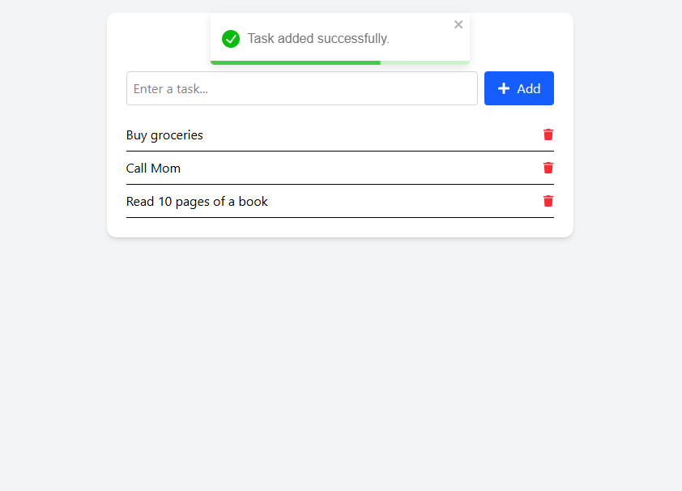
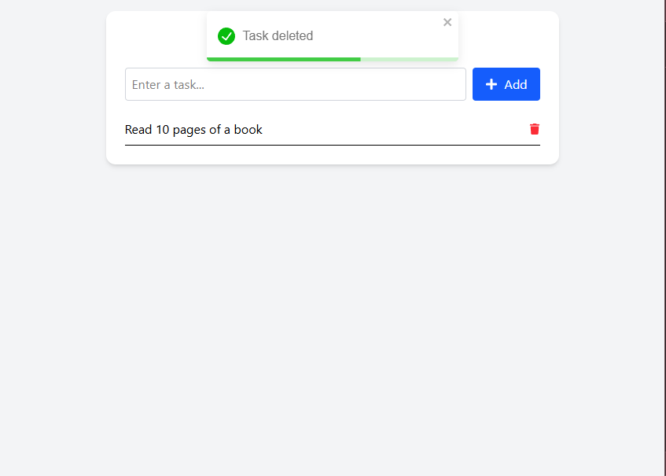

# 📝 To-Do List App (Fullstack MERN)

A full-stack To-Do list application built with **Node.js**, **Express**, **React**, **Tailwind CSS**, **Axios**, and **React Toastify**. Users can add, update, complete, and delete tasks — all stored in memory on the backend.

---

## 🚀 Live Demo

- 🔗 **Frontend (Vercel):** [https://todo-frontend.vercel.app](https://todo-app-weld-theta-79.vercel.app)
- 🔗 **Backend (Render):** [https://todo-backend.onrender.com](https://todo-app-51ct.onrender.com)
- 💻 **GitHub Repo:** [https://github.com/sharmaharshit2000/todo-app](https://github.com/sharmaharshit2000/todo-app)

---

## 📸 Screenshots

### 📌 Home UI (Responsive)


### 📌 Add Task (With Toast)



### 📌 Edit Task (With Toast)


### 📌 Delete Task (With Toast)


---

## 📁 Project Structure

```
todo-app/
├── backend/
│   ├── server.js
│   ├── routes/taskRoutes.js
│   ├── controllers/taskController.js
│   ├── data/tasks.js
├── frontend/
│   ├── src/
│   │   ├── App.jsx
│   │   ├── index.css
│   │   ├── main.jsx
│   │   ├── api/api.js
│   │   └── components/
│   │       ├── TaskForm.jsx
│   │       └── TaskList.jsx
│   ├── public/
│   └── tailwind.config.js
```

---

## 📦 Tech Stack

- **Frontend:** React, Vite, Tailwind CSS, Axios, React Toastify, React Icons
- **Backend:** Node.js, Express
- **Hosting:** Vercel (frontend), Render (backend)

---

## 🛠️ Getting Started

### 🔧 Prerequisites

- Node.js and npm
- Git

---

### 🔌 Backend Setup

```bash
cd backend
npm install
npm run dev
```

- Server runs on: `http://localhost:5000`

---

### 🌐 Frontend Setup

```bash
cd frontend
npm install
npm run dev
```

- App runs on: `http://localhost:5173`

> **.env (Frontend)**

```env
VITE_API_BASE_URL=http://localhost:5000
```

---

## 🧪 Features

- ✅ Add task with validation
- ✅ Toggle task completion
- ✅ Delete task
- ✅ Toast feedback
- ✅ Mobile responsive
- ✅ Icons for actions


---

## ✨ Author

**Harshit Sharma**  
🔗 GitHub: [@sharmaharshit2000](https://github.com/sharmaharshit2000)
